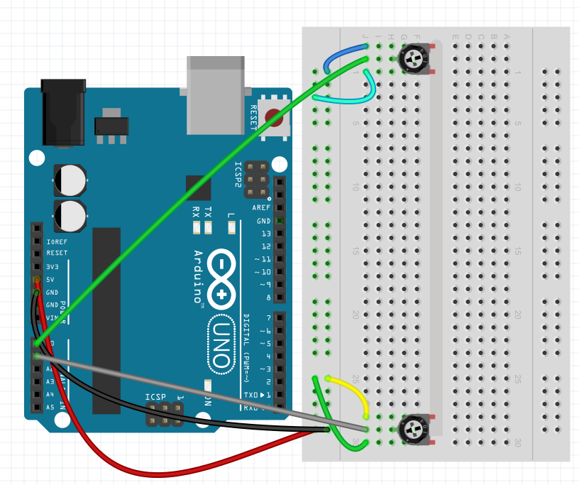

# Build an electronic EtchASketch
In this lab we will use the Arduino to build an electronic version of the EtchASketch toy.

### Step 1: Build the circuit
Our EtchASketch will use the following parts:
- 2 potentiometers
- Jumper wires   
   
Use the following circuit diagram to construct the circuit. The direction of the photoresistor and the 10KΩ resistor is unimportant.   

### Step 2: Test the circuit
TBD

### Step 3: Write the program
TBD

### Step 4: Submit your finished program
Have your teacher or a TA verify that you have a working program. Submit your finished program by uploading the .sb file to Google classroom. You should be able to find it in *My Documents | Scratch Projects*. If you worked with a partner, each partner should submit a copy of the finished program to Google classroom.
