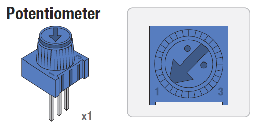
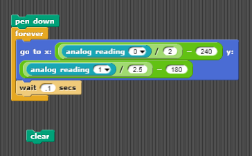

# Build an electronic EtchASketch
In this lab we will use the Arduino to build an electronic version of the EtchASketch toy.

### Step 1: Build the circuit
Our EtchASketch will use the following parts:
- 2 potentiometers
- Jumper wires   
   
A potentiometer is a kind of resistor. The potentiometer in the Sparkfun kit is blue with a knob that turns. Turning the knob changes the resistance.  

Use the following circuit diagram to construct the circuit.    

### Step 2: Test the circuit
Create forever loops that say *analog reading 0* and *analog reading 1*. Check to see that the values change when you turn the potentiometers.

### Step 3: Write the program
You will find the *analog reading*, *goto x y*, *pen down*, *wait* and *forever* blocks helpful. Below is an example program.
   
Note that you can hide the picture of the Arduino sprite with a *hide* block.

### Step 4: Submit your finished program
Have your teacher or a TA verify that you have a working program. Submit your finished program by uploading the .sb file to Google classroom. You should be able to find it in *My Documents | Scratch Projects*. If you worked with a partner, each partner should submit a copy of the finished program to Google classroom.
